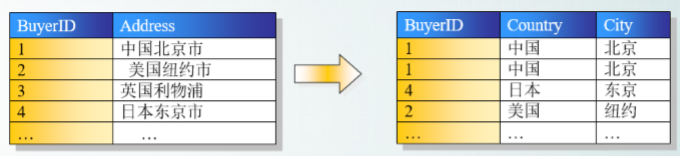
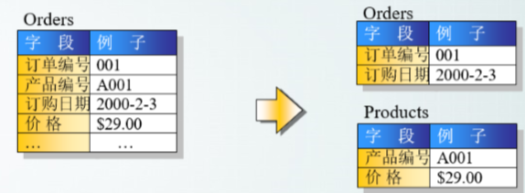

# 数据范式

#### 第一范式（1stNF 列都是不可再分的）
第一范式的目标是确保每列的原子性:如果每列都是不可再分的小数据单元（也称为小的原子 单元），则满足第一范式（1NF）

#### 第二范式(2nd NF－每个表只描述一件事情) 
首先满足第一范式，并且表中非主键列不存在对主键的部分依赖。 第二范式要求每个表只描述一 件事情。 

#### 第三范式(3rd NF 不存在非主键列的传递依赖) 
第三范式定义是，满足第二范式，并且表中的列不存在对非主键列的传递依赖。除了主键订单编号外，顾客姓名依赖于非主键顾客编号。 

