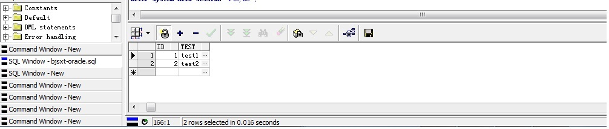
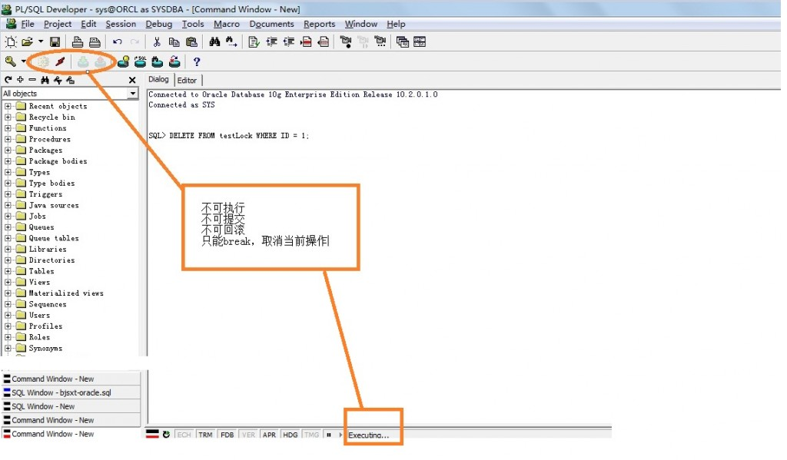

# oracle死锁问题

### 常用的会话查询SQL如下：
```sql
-- 查询所有会话
select * from v$session where username is not null order by logon_time, sid
-- 查询用户会话
select * from v$session where username = user order by logon_time, sid
-- 查询活动会话
select * from v$session where username is not null and status = 'ACTIVE' order by logon_time, sid
```


### 死锁以及解决方法

#### 1、删除和更新之间引起的死锁
造成死锁的原因就是多个线程或进程对同一个资源的争抢或相互依赖。这里列举一个对同一个资源的争抢造成死锁的实例。
```sql
--Oracle 10g, PL/SQL version 9.2
CREATE TABLE testLock(  ID NUMBER, 
test VARCHAR(100)  ) 
COMMIT  

INSERT INTO testLock VALUES(1,'test1'); 
INSERT INTO testLock VALUES(2,'test2'); 
COMMIT; 
SELECT * FROM testLock 
```

死锁现象的重现：          
1)在sql 窗口 执行：SELECT * FROM testLock FOR UPDATE; -- 加行级锁 并对内容进行修改，不要提交。


2)另开一个command窗口，执行：delete from testLock WHERE ID=1;               
此时发生死锁（注意此时要另开一个窗口，不然会提示：POST THE CHANGE RECORD TO THE DATABASE. 点yes 后强制commit）：


3)死锁查看：
```sql
select s.username,l.object_id, l.session_id,s.serial#, 
s.lockwait,s.status,s.machine,s.program from v$session s,
v$locked_object l 
where s.sid = l.session_id;
```
字段说明：
- Username：死锁语句所用的数据库用户；
- SID: session identifier， session 标示符，session 是通信双方从开始通信到通信结束期间的一个上下文。
- SERIAL#: sid 会重用，但是同一个sid被重用时，serial#会增加，不会重复。
- Lockwait：可以通过这个字段查询出当前正在等待的锁的相关信息。
- Status：用来判断session状态。Active：正执行SQL语句。Inactive：等待操作。Killed：被标注为删除。
- Machine： 死锁语句所在的机器。
- Program： 产生死锁的语句主要来自哪个应用程序。

4)查看引起死锁的语句：
```sql
select sql_text from v$sql where hash_value in   
(select sql_hash_value from v$session where sid in  
(select session_id from v$locked_object));  
```

5)死锁的处理：
```sql
alter system kill session '144,145';  
```

此时在执行delete语句的窗口出现：
```sql
delete from testLock where  ID = 1;  
-->
delete from testLock where  ID = 1  
ORA-00028: 您的会话己被终止  
```
再查看一下死锁，会发现已经没有stauts为active的记录了：
```sql
select s.username, l.session_id,s.serial#, s.lockwait,s.status,s.machine,s.program from v$session s,v$locked_object l where s.sid = l.session_id;  
```
发生死锁的语句已经被终止。


